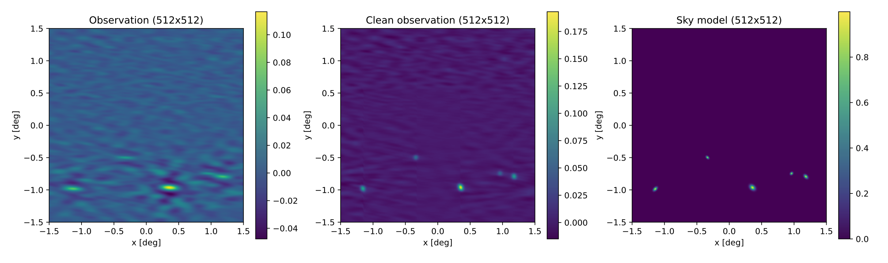

# Argosim
Python package for radio interferometric observation simulations and image reconstruction.

Software developed at the [CosmoStat](https://www.cosmostat.org/) laboratory, CEA, Paris-Saclay, for the [ARGOS](https://argos-telescope.eu) telescope.

## Basic installation
```
pip install .
```

## Docker installation

### Build the docker image (optional)
```
docker build -t ghcr.io/argos-telescope/argosim:main .
```
Build the doker image from the argosim repository.

### Pull the docker image
```
docker pull ghcr.io/argos-telescope/argosim:main
```
Directly pull the docker image from the github container registry. You may need to login to the registry before pulling the image.

### Run a Docker container
```
docker run -itv $PWD:/workdir --rm ghcr.io/argos-telescope/argosim:main
```
Run the an _argosim_ container with an interactive shell. Mount the current directory (`$PWD`) to the container's workdir. 
The modifications and outputs produced while running in the container will be saved in the host machine at `$PWD`.
The argosim files (src, scripts, notebooks, etc.) are located at the `/home` directory in the container.

### Test example on the container
```
(argosim) root@container_id:/workdir# python /home/scripts/test.py
```
The output images are saved to `/workdir` inside the container and will be available in the host machine at `$PWD`.

### Launch a jupyter notebook server
```
docker run -p 8888:8888 -v $PWD:/workdir --rm ghcr.io/argos-telescope/argosim:main notebook
```
The jupyter notebook server is running on the container. Copy the url (127.0.0.1:8888/tree?token=...) and paste it on the browser.

To exit the container, shut down the jupyter kernel from the browser. The container will be automatically stopped.

All the notebooks created or modified in the container will be saved in the host machine at `$PWD`. If wanted to run an existing notebook, copy it to the current mounted directory (`$PWD`) before or while runing the container.

## Examples
### Antenna positions, baselines and uv-sampling for an ARGOS pathfinder-like array:

The aperture synthesis uv-sampling has ben simulated for the following parameters:

**Source tracking parameters**
- Array latitude: 35.0 deg
- Source declination: 90.0 deg
- Source right ascension: [-.5, .5] hours
- $\Delta t$ = 900.0 segs (15 minutes)
- Number of time samples: 4

**Multiband tracking parameters**
- Centre frequency: 2 GHz
- Bandwidth: 1 GHz
- Number of channels: 11

### Observation simulation for an ARGOS pathfinder-like array


### Image reconstruction using the Hogbom's Clean algorithm


**Clean Parameters**
- Max number of iterations: 100
- Gain: 0.2
- Threshold: 1e-3
- Clean beam size (pixels): 10

## Useful docker commands
```
# List of all images
docker images

# List of all containers
docker ps -a
```
